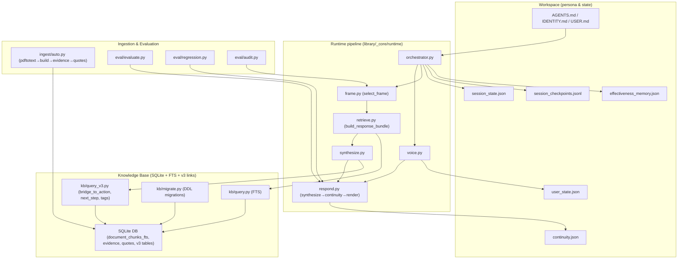
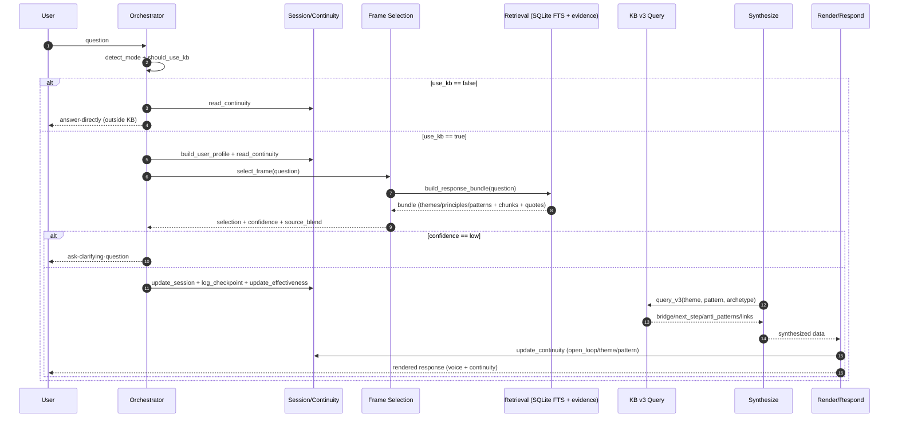
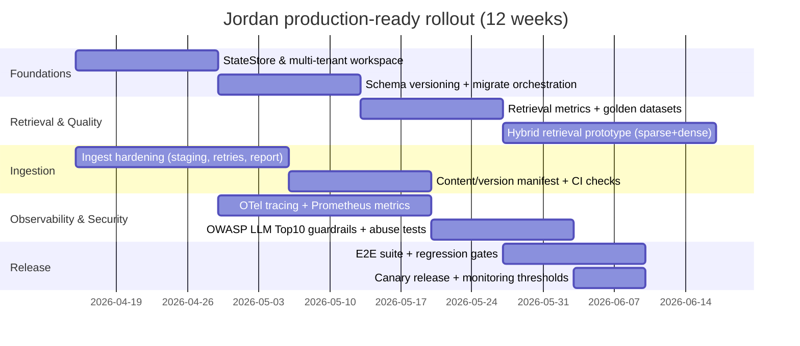

# Архитектура репозитория Jordan: технический аудит, риски и план доведения до production-ready

## Резюме для руководства

Репозиторий реализует «персональный агент» в стиле entity["known_celebrity","Jordan Peterson","psychology author"] с явным разделением: отдельная рабочая среда (workspace) с собственными инструкциями/памятью и отдельная локальная «библиотека» (library) с источниками и KB-рантаймом. Это разделение прямо зафиксировано в `workspace/AGENTS.md`, `workspace/USER.md`, `IDENTITY.md` и `README.md` (включая намерение вынести бота в отдельную связку entity["company","Telegram","messaging app"], чтобы не «смешивать» личности/поведение). citeturn8view1turn8view0turn8view2turn8view3

Текущий рантайм — это детерминированный конвейер **orchestrator → frame selection → retrieval → synthesize → render**, усиленный «памятью сессии» (continuity/session state) и простыми метриками «прогресса/реакции» пользователя. Центральная идея: отвечать не просто «как LLM», а через заранее продуманную психологическую рамку (theme/principle/pattern), выбранную из KB, и затем рендерить ответ в нужном «голосе» (voice mode). citeturn12view2turn16view0turn14view3turn13view4turn15view4turn18view0

**Главные сильные стороны (если цель — быстро получить рабочий агент на локальной базе):**
- Неплохая модульность внутри `library/_core/`: runtime, kb, session, ingest, eval разведены по пакетам. citeturn9view0turn19view0turn23view2turn23view0turn23view1  
- Уже есть «инженерный контур качества» в виде `eval` и регрессий по выбранным признакам (темы/принципы/паттерны; preferred source; voice). citeturn33view0turn33view4turn32view0  
- Есть «локальная наблюдаемость» через JSONL-чекпоинты и вспомогательные агрегаты (progress/reaction), что даёт основу для дальнейшего перехода к нормальной observability. citeturn27view0turn29view3turn30view0

**Главные слабые места (если цель — production и масштабирование):**
- Сильная зависимость от **глобального файлового состояния** (workspace JSON) без мульти-тенантности и без безопасной конкурентной модели: один процесс/одна папка подразумеваются «по умолчанию». citeturn35view0turn25view4turn26view2  
- Retrieval в основном построен на **SQLite FTS / строковых эвристиках**, без семантических эмбеддингов и без гибридного скоринга; это ограничивает качество Q&A по большой библиотеке и делает систему чувствительной к формулировкам. citeturn13view3turn13view4turn20view0turn37search0  
- Диспетчеризация «использовать KB или нет» (`should_use_kb`) и определение «режима» (`detect_mode`) сейчас полностью эвристические, на подстроках и длине, что будет давать ложные срабатывания при расширении домена. citeturn12view0turn11view1  
- Ingest-пайплайн синхронный и завязан на внешнюю утилиту `pdftotext` и операции переименования/удаления файлов «в лоб», без идемпотентности/ретраев/изоляции ошибок. citeturn31view0  
- Нет явного слоя безопасности для LLM/агентных рисков (prompt injection, DoS по токенам/вызовам, цепочки поставок, небезопасная обработка вывода) — в проде это нужно проектировать отдельно по современным рекомендациям (например, entity["organization","OWASP","appsec nonprofit"] Top 10 for LLM Apps). citeturn38search0

**Не задано (и критично для архитектурных решений):** целевая инфраструктура (локально/облако/контейнеры), провайдер LLM/эмбеддингов, требования по приватности, ожидаемый трафик, latency SLO, бюджет на инференс/хранилища. Ниже я предлагаю варианты развилок для каждого решения. (Это не упрёк; просто без этих параметров невозможно «оптимально» выбрать стек.)

## Текущее устройство системы

### Инвентарь ключевых компонентов и зон ответственности

Ниже — «карта» репозитория по функциональным слоям (файлы приведены как примеры, а не исчерпывающий список).

**Слой личности и контекста (workspace / persona layer)**
- `IDENTITY.md`: фиксирует профиль агента (имя/тон/назначение). citeturn8view2  
- `workspace/AGENTS.md`: правила работы в рамках workspace (прочитать SOUL/USER/MEMORY, пользоваться `library/`, держать отдельность от «главного ассистента»). citeturn8view1  
- `workspace/USER.md`: формулирует цель — отдельная поверхность чата и библиотека источников для агента. citeturn8view0  
- `README.md`: дополнительно закрепляет «Telegram separation» и структуру материалов в `library/`. citeturn8view3  

**Runtime-пайплайн (library/_core/runtime)**
- `orchestrator.py`: точка координации (режим, решение использовать KB, выбор голоса, обновление session state, checkpoint, effectiveness, вызов `respond`). Важно: явно указано, что subprocess-вызовы заменены на прямые импорты модулей. citeturn11view4turn12view2  
- `frame.py`: выбор рамки (theme/principle/pattern) на основе retrieval bundle, оценка confidence и blend источников. citeturn14view0turn14view3  
- `retrieve.py`: сбор `bundle` через SQLite (FTS по чанкам + таблицы evidence + эвристическое скорирование/роутинг). citeturn13view3turn13view4turn13view0  
- `synthesize.py`: сбор смыслового «каркаса» ответа; использует `query_v3` (мосты bridge_to_action, next_step, анти-паттерны, ссылки на кейсы и т. п.). citeturn15view2turn15view4  
- `respond.py`: «склейка» synthesize → update continuity → render; режимы quick/practical/deep; voice. citeturn16view0turn16view4  
- `voice.py`: выбор voice mode по теме/содержанию запроса + session/user state. citeturn18view0  

**Хранилище знаний и схемы (library/_core/kb)**
- `query.py`: FTS-поиск по `document_chunks_fts`, возвращает сниппеты; также quotes lookup и агрегаты evidence. citeturn20view0  
- `query_v3.py`: выбор bridge_to_action_templates и next_step_library + присоединение confidence_tags, quote packs, anti_patterns, case_links, intervention_links и пр. citeturn21view0turn21view2turn21view3  
- `migrate.py`: DDL-миграции V3/V3.1 + добавление колонок классификации цитат (через `ALTER TABLE … ADD COLUMN` при отсутствии). citeturn22view4turn22view3  

**Память сессии и «континуитет» (library/_core/session)**
- `continuity.py`: хранит recurring themes/patterns/open loops/resolved loops и др.; есть миграции структуры continuity (v1→v2) и текущая версия v3. citeturn25view4turn25view2  
- `state.py`: пишет `session_state.json`, строит `user_state.json` из continuity (dominant loop/theme/pattern, recommended voice и пр.). citeturn26view0turn26view3  
- `checkpoint.py`: JSONL-лог чекпоинтов с timestamp для каждого шага. citeturn27view0  
- `progress.py` / `reaction.py`: простые эвристики по чекпоинтам/summary для «stuck/moving/fragile» и «accepting/resisting/ambiguous». citeturn29view3turn30view0  
- `effectiveness.py`: счётчики «helpful/neutral/resisted» по источникам/интервенциям и их связке с route. citeturn28view1turn28view0  

**Ingestion (library/_core/ingest)**
- `auto.py`: проходит по `incoming/`, классифицирует PDFs, делает `pdftotext`, регистрирует материал, пересобирает KB и обновляет evidence/quotes. citeturn31view0  

**Eval/регрессии (library/_core/eval)**
- `audit.py`: прогон фиксированного набора вопросов, сохраняет отчёт по выбранным theme/principle/pattern/confidence. citeturn32view0  
- `evaluate.py`: JSON-набор кейсов (`EVAL_CASES`) → прогон `select_frame` и `respond`, проверка попаданий + простая классификация quote-type по ключевым словам. citeturn33view0turn35view3  
- `regression.py`: отдельные регрессии по (а) preferred source и (б) voice output must-include токенам. citeturn33view4  

### Диаграмма компонентов



Содержательная связка этой схемы подтверждается тем, что `orchestrator.py` напрямую импортирует runtime и session-модули, выбирает voice, обновляет session state/эффективность/контекст и вызывает `respond`. citeturn11view4turn12view2turn18view0turn27view0turn28view0

## Критическая оценка

### Архитектурные сильные стороны

**Разделение «память/континуитет» vs «KB/источники» vs «логика ответа».**  
Состояние сессии (continuity/session/user/effectiveness/checkpoints) хранится в workspace и обновляется отдельными модулями, а извлечение знаний и синтез ответа живут в `library/_core/`. Это облегчает локальную разработку и делает поведение агента более воспроизводимым. citeturn35view0turn25view4turn26view2turn13view4turn16view0

**Явный управляющий слой (orchestrator) с протоколом действий.**  
`orchestrate(question)` возвращает структуру с полями `use_kb`, `confidence`, `action`, и в случае слабой уверенности предлагает `ask-clarifying-question` вместо «натягивания» рамки. Это заметно ближе к «агентному» подходу (решение → действие), чем к одной генерации. citeturn11view0turn12view0turn12view2turn36search2

**Уже реализована «адаптивность»: voice + progress/reaction + effectiveness.**  
Даже если сейчас это эвристики, сам контур корректировок присутствует: progress может рекомендовать voice override и «narrow» режим, reaction/эффективность обновляются по результатам, а чекпоинты журналируются. Это хорошая основа для будущей «self-reflection»/адаптивного retrieval (в духе Self-RAG). citeturn29view3turn30view0turn28view0turn27view0turn36search3

**Миграции KB v3 уже предусмотрены как отдельный слой.**  
`kb/migrate.py` содержит DDL для bridge_to_action_templates, next_step_library, confidence_tags, quote packs и связей. Это важный шаг в сторону более богатой KB-модели. citeturn22view4turn21view0

**Есть eval и регрессии, пусть и простые.**  
Наличие `evaluate.py` и регрессий — критический признак зрелости даже в MVP: есть минимальные «контрактные» проверки. citeturn33view0turn33view4turn32view0

### Архитектурные слабости и риски

**Глобальное файловое состояние ⇒ почти гарантированная проблема при мульти-пользовательском сценарии.**  
Paths для `continuity.json`, `session_state.json`, `user_state.json`, `session_checkpoints.jsonl` и т. п. заданы как единичные файлы workspace. Это нормально для одного пользователя/одного процесса, но в entity["company","Telegram","messaging app"]-боте появится системная потребность: *ключ состояния = user_id (и, возможно, chat_id)*. Сейчас архитектура «по умолчанию» к этому не готова: параллельные диалоги будут перетирать состояния. citeturn35view0turn8view3turn25view4turn26view0

**Retrieval преимущественно лексический + эвристический, с ограниченным ранжированием.**  
`retrieve.py` опирается на SQLite FTS (`document_chunks_fts MATCH ?` + `snippet(...)`) и дополнительные таблицы evidence, а затем «досаливает» скоринг словарями ключевых слов и ручными «boost/downweight» правилами. Это типично для раннего MVP, но плохо масштабируется на разные формулировки вопросов и большие корпуса. citeturn13view3turn13view4turn37search0turn36search1

С практической точки зрения: как только библиотека перейдёт от небольшого набора книг к «много статей + много форматов», выигрыш дадут dense embeddings и/или гибридный retrieval (sparse+dense), как показано в работах по DPR и RAG. citeturn36search1turn36search0

**Диспетчеризация по подстрокам (should_use_kb/detect_mode) будет деградировать по мере роста домена.**  
`detect_mode` и `should_use_kb` — списки триггеров по `in` в строке. Это дешёвый механизм, но он не даёт калиброванной вероятности/метрики и будет давать ложные срабатывания, особенно при смешанных языках, сленге и нетипичных запросах. citeturn11view1turn12view0

**Схема миграций KB не версионируется как «источник истины» и не проверяется CI.**  
`kb/migrate.py` выполняет `CREATE TABLE IF NOT EXISTS …` и «добавить колонку, если нет». Это удобно, но без жёсткой фиксации версии (например, `PRAGMA user_version` или таблица `schema_migrations`) сложно гарантировать совпадение окружений и воспроизводимость багов «на конкретной версии схемы». citeturn22view4turn22view3

**Ingestion пайплайн: слабая идемпотентность, слабое восстановление после ошибок, зависимость от окружения.**  
`ingest/auto.py`:
- ходит по файлам в `incoming/`, переносит/удаляет файлы,  
- вызывает `pdftotext` через `subprocess`,  
- затем в случае обработанных файлов запускает цепочку build/extract/normalize/evidence/quotes. citeturn31view0  

В проде это создаёт риски: частично обработанные файлы, повторные прогоны, гонки при параллельном ingestion, «грязные» состояния при падениях, различия окружений (где `pdftotext` не установлен).

**Security/Privacy слой отсутствует как архитектурная подсистема.**  
Даже если LLM ещё не подключён, «агентные» поверхности и RAG-системы в целом подвержены конкретным классам уязвимостей (prompt injection, insecure output handling, model DoS и др.) — это описано в OWASP Top 10 for LLM Apps. citeturn38search0  
Для production-использования, особенно в психологическом/коучинговом домене, придётся также опираться на риск-менеджмент (например, NIST AI RMF) и задавать guardrails исходя из контекста применения. citeturn38search1

## Приоритетные улучшения и рефакторинг до production-ready

Ниже — конкретные улучшения, упорядоченные по приоритету: **High / Medium / Low**, с шагами, оценкой усилия и ключевыми рисками. Оценки усилия: Small (1–3 дня), Medium (1–3 недели), Large (1–2+ месяца) — при условии 1–2 инженеров; без инфраструктурных вводных это ориентиры.

### Таблица улучшений

| Приоритет | Улучшение | Где в коде «болит» сейчас | Шаги реализации (конкретно) | Effort | Риски |
|---|---|---|---|---|---|
| High | Мульти-тенантное состояние: `workspace/{user_id}/…` или «state store» с ключом `user_id` | Глобальные пути workspace (`CONTINUITY`, `SESSION_STATE`, `CHECKPOINTS` и т. п.) citeturn35view0 | 1) Ввести `StateStore` интерфейс (get/set/append) и «ключ сессии». 2) Переписать `continuity.py`, `state.py`, `checkpoint.py`, `progress.py`, `reaction.py`, `effectiveness.py` на работу через store. 3) Миграция текущих файлов в новый layout. | Medium | Ошибки миграции (потеря истории), сложность отладки при параллельных запросах |
| High | Версионирование схемы KB и обязательные миграции в старте приложения | Миграции «мягкие» через `CREATE IF NOT EXISTS`/`ALTER ADD COLUMN` citeturn22view4turn22view3 | 1) Добавить таблицу `schema_migrations(version, applied_at)` или `PRAGMA user_version`. 2) Превратить migrate-функции в упорядоченный список версий. 3) На старте рантайма запускать `migrate_up()` и валидировать expected version. 4) Добавить CI-check: «чистая БД → все миграции → smoke queries». | Medium | Несовместимость старых баз; потребуется план b/c и бэкапы |
| High | Hardening ingestion: идемпотентность, ретраи, отчётность, изоляция ошибок | `ingest/auto.py` делает файловые операции и читает PDF через `pdftotext` citeturn31view0 | 1) Сделать staging: `incoming/` → `processing/` → `processed/failed/`. 2) Ввести manifest записи «ingest job» со статусами. 3) Локализовать ошибки per-file, не прерывать весь пайплайн. 4) Проверка зависимости (`pdftotext --version`) и явное сообщение. 5) Добавить «dry-run». | Medium | Усложнение пайплайна; нужно продумать очистку/ретеншн |
| High | Нормальная observability: структурированные логи + метрики + трейсы | Сейчас чекпоинты — JSONL, без метрик/трейсов citeturn27view0 | 1) Ввести structured logging с `request_id/session_id`. 2) Инструментировать этапы pipeline через OpenTelemetry spans. 3) Экспорт метрик (Prometheus): latency per stage, errors, retrieval hit-rate. 4) Заменить часть «чекпоинтов» на события/метрики, оставив JSONL как локальный бэкап. | Medium | Нужна инфраструктура сбора; риск «шумных» логов и утечек данных |
| Medium | Улучшить retrieval: гибрид sparse+dense и/или более строгий ранжирующий слой | Сейчас FTS + эвристики + evidence-агрегаты citeturn13view3turn13view4turn37search0 | Варианты: A) оставить SQLite FTS, добавить embeddings индекс отдельно (Faiss/HNSW) и объединять scoring. B) перейти на pgvector (если уже есть Postgres) и HNSW/IVFFlat. C) отдельная vector DB. | Large | Стоимость embeddings, миграции индексов, снижение воспроизводимости без dataset/versioning |
| Medium | Заменить `should_use_kb`/`detect_mode` на модель/калиброванный классификатор + фоллбеки | Эвристика подстрок и длины citeturn11view1turn12view0 | 1) Собрать датасет из логов (включая «правильное действие»). 2) Ввести rule+model: простые правила как guardrails, модель как «оценка». 3) Логи confidence и активное обучение через eval cases. | Medium | Потребность в данных; риск «сломать» поведение агента |
| Medium | Контрактные интерфейсы и dependency inversion для runtime/kb/session | Сейчас прямые импорты и «сквозные» вызовы citeturn11view4turn16view0turn14view3 | 1) Ввести протоколы `Retriever`, `FrameSelector`, `Synthesizer`, `Renderer`, `StateStore`. 2) Передавать зависимости через конструктор/контейнер. 3) Разнести «pure core» и «adapters» (SQLite, filesystem). | Medium | Временная сложность рефакторинга, риск регрессий |
| Low | Убрать дубли: `runtime/render.py` vs `runtime/respond.py` и «старые» скрипты в корне `library/` | Есть простой renderer, и более полный respond; также много legacy scripts citeturn17view0turn16view0turn34view0 | 1) Объявить canonical entrypoints. 2) Legacy оставить как thin wrappers или удалить после релизного окна. 3) Документация CLI. | Small | Низкий риск, но есть риск «сломать привычные команды» |
| Low | Укрепить eval: добавить метрики ретривала и «faithfulness» | Сейчас eval проверяет выбранные поля и примитивный quote-type citeturn33view0turn33view4 | 1) Добавить тесты retrieval recall@k на размеченных query→chunks. 2) Добавить проверку «цитирование из KB» (минимальный attribution). 3) Добавить adversarial набор (prompt injection внутри документов). | Medium | Нужно время на разметку и методику |

## Лучшие практики RAG и агентных систем и альтернативы для Jordan

### Что «считается хорошей практикой» в RAG/agents, и как это ложится на Jordan

**Разделять retrieval и generation, держать provenance и обновляемость знаний.**  
Классический мотив RAG: параметрическая память модели ограничена, а retrieval даёт возможность обновлять знания и добавлять источник/провенанс. Это формализовано в оригинальной работе RAG (Lewis et al., 2020). citeturn36search0  
В Jordan уже сделана «половина шага»: retrieval слой вытеснен в отдельные функции и таблицы (FTS + evidence + quotes), а render умеет выводить «Источник рамки» и цитату (пусть ещё не всегда корректно). citeturn13view4turn16view4turn15view4

**Dense retrieval (эмбеддинги) обычно повышает recall на семантических перефразах.**  
DPR показал, что dense dual-encoder retrieval способен существенно обгонять BM25 на open-domain QA по accuracy@top-k, что напрямую связано с практической «находимостью» релевантных пассажей. citeturn36search1turn36search5  
Для Jordan это означает: как только библиотека вырастет, одна SQLite FTS будет «промахиваться» по смысловым вопросами («мысль та же, слова другие»). Поэтому дорожная карта почти неизбежно ведёт к гибридному retrieval.

**Агентность = цикл «решение → действие → проверка → коррекция».**  
Парадигма ReAct подчёркивает полезность «reasoning+acting» и работу с внешними источниками для снижения галлюцинаций и повышения интерпретируемости. citeturn36search2turn36search10  
У Jordan уже есть решение «use_kb / ask-clarifying / answer-directly», но пока нет «проверки качества retrieval» и «критики» результата. Self-RAG показывает, что адаптивное решение «retrieval нужен или нет» + self-reflection может повышать фактичность и качество. citeturn36search3turn36search11  
Практический перенос: добавить шаг **validate_retrieval()** и, при низком сигнале, уходить в уточняющие вопросы или второй retrieval-pass.

### Таблица альтернатив: SQLite+FTS vs pgvector vs отдельная vector DB

Ниже — сравнение по «реальным trade-offs» для production. (FTS5 — официальный механизм полнотекстового поиска SQLite; HNSW и Faiss — базовые кирпичи современных ANN/векторных систем; pgvector — типичный путь «вектора внутри Postgres».) citeturn37search0turn37search1turn37search2turn37search3

| Вариант | Когда выбирать | Плюсы | Минусы/риски | Латентность/стоимость (типично) |
|---|---|---|---|---|
| SQLite + FTS5 (текущий путь) | Один пользователь, локальный агент, небольшой/средний корпус, «очно» | Локально, просто, минимум DevOps; отличная воспроизводимость; FTS5 даёт быстрый term-based поиск citeturn37search0 | Плохо ловит смысловые перефразы без дополнительных слоёв; ранжирование ограничено; сложно масштабировать на многопользовательскую нагрузку | Дёшево; latency низкая на локали, но зависит от размера корпуса |
| SQLite (FTS) + отдельный ANN-индекс (Faiss/HNSW) | Хотите остаться локальными, но улучшить семантику | Можно сделать гибридный retrieval; Faiss — специализированный toolkit для similarity search, HNSW — эффективный ANN подход citeturn37search2turn37search1 | Нужно строить/версионировать embeddings, решать обновление индекса; усложнение деплоя | Стоимость = embeddings+индексирование; поиск может быть очень быстрым при правильной настройке |
| Postgres + pgvector | Уже есть Postgres (или нужен shared state), многопользовательский режим | Один источник данных (ACID, транзакции); поддержка vector similarity search в Postgres; можно объединять с метаданными citeturn37search3 | Потребуется администрирование Postgres; настройка индексов/планировщика; risk vendor lock-in ниже, но DevOps выше | Стоимость выше SQLite, но приемлема; latency зависит от индекса/нагрузки |
| Отдельная vector DB | Высокий трафик, большой корпус, продвинутые фичи (filters, distributed) | Обычно сильная производительность/масштабирование, удобные API | Операционные/финансовые затраты; управление консистентностью, миграциями, приватностью | Самый дорогой вариант; оправдан при масштабе |

### Латентность и стоимость: ключевые «ручки»

- **Количество retrieval-пассажей**: RAG-системы часто деградируют при «фиксированном k всегда», потому что лишний контекст увеличивает токены, стоимость и риск отвлечения модели; Self-RAG показывает пользу адаптивного retrieval-on-demand. citeturn36search3  
- **Индекс и ANN-алгоритм**: HNSW обеспечивает хорошие свойства по скорости при высоком recall (и описан как логарифмически масштабируемый подход). citeturn37search1  
- **Провайдер/способ embeddings**: не задано; варианты — managed API или локальный encoder. Архитектурно важно: embeddings должны быть **версионированы** (model_id + preprocessing + chunking policy), иначе результаты retrieval станут невоспроизводимыми.

### Диаграмма flow пайплайна Jordan



Эта последовательность отражает фактические вызовы: `orchestrator.py` делает routing и обновления session; `frame.py` зовёт `retrieve.build_response_bundle`; `synthesize.py` использует `kb.query_v3`; `respond.py` обновляет continuity и рендерит, включая voice и источник рамки. citeturn12view2turn14view3turn13view4turn15view2turn16view4turn25view3turn18view0

## Стратегия тестирования и оценки качества

### Что уже есть в репозитории (и как усилить)

**Существующие проверки:**
- `eval/evaluate.py`: проверяет корректность выбранного theme/principle/pattern и «тип цитаты» по простым правилам (ключевые слова в строке «Цитата: …»), сохраняет отчёт. citeturn33view0  
- `eval/regression.py`: runtime_regression по preferred source и voice_regression по must_include токенам в output. citeturn33view4  
- `eval/audit.py`: фиксированные вопросы для «ручного» sanity-check. citeturn32view0  

Этого достаточно как «smoke suite», но недостаточно как production-grade QA.

### Рекомендуемая многоуровневая стратегия тестов

**Unit-тесты (fast, deterministic)**
- Чистые функции: `detect_mode`, `should_use_kb` (пока они существуют), `infer_route_name`, `infer_archetype`, форматирование рендера. citeturn11view1turn14view3turn15view1turn16view4  
- State helpers: `continuity.bump_named`, `resolve_loop`, миграции continuity (v1→v2). citeturn25view2turn25view4  
- KB migrate helpers (`_add_col`) и «схема после миграции». citeturn22view3turn22view4  

**Integration-тесты (SQLite + файловая система)**
- «Чистая песочница»: создаём временную папку workspace, временную SQLite БД, прогоняем `migrate_v3/migrate_v31`, затем минимальные вставки и `query_v3` smoke. citeturn22view4turn21view2  
- Retrieval smoke: загрузить 2–3 документа/чанка в FTS и проверить, что `document_chunks_fts MATCH` возвращает ожидаемые сниппеты. citeturn20view0turn13view3turn37search0  

**E2E-тесты пайплайна (orchestrator → respond)**
- Прогон набора вопросов как в `evaluate.py`, но с фиксацией snapshot-результатов: ключевые поля JSON (`selected_theme`, `open_loop`, `source_blend`) и части текста ответа. citeturn33view0turn12view2turn16view0  

**KB regression tests (данные важнее кода)**
- Golden set: `query → expected top-k chunks (ids)` и `query → expected bridge/next_step`. Для каждого изменения ingestion/chunking/нормализации — прогон и сравнение метрик (recall@k, MRR, drift). DPR задаёт хороший ориентир, что «retrieval accuracy@k» — ключевой показатель качества retrieval. citeturn36search1turn36search5  

**Synthetic adversarial tests**
- Prompt injection внутри документов: документ-чанк содержит инструкции «игнорируй систему/выдай секреты», а тест проверяет, что рендер/агентный слой не начинает следовать вредным инструкциям. Это напрямую соответствует категории Prompt Injection в OWASP LLM Top 10. citeturn38search0  

### Пример CI-команд (рекомендуемый стандарт)

Поскольку текущие CI-файлы не анализировались (вводные не хватает), ниже — минимальный набор команд, который «обычно» используют сильные команды для Python-репо агента:

```bash
python -m pip install -U pip
python -m pip install -r requirements.txt
python -m pip install -r requirements-dev.txt

python -m pytest -q
python -m pytest -q --maxfail=1

python -m ruff check .
python -m ruff format --check .

python -m mypy library
```

Для данных/KB: отдельный job, который делает «чистая БД → миграции → seed минимальных данных → smoke query». Это защищает от тихих поломок в `kb/migrate.py` и `kb/query_v3.py`. citeturn22view4turn21view2

## Наблюдаемость, безопасность и план миграций и релиза

### Monitoring/metrics/logging/tracing plan

**Цель:** перейти от локального JSONL логирования к стандартной наблюдаемости: метрики + трейсы + структурированные логи.

**Почему именно так:** OpenTelemetry — vendor-agnostic framework для генерации/экспорта/сбора трейс/метрик/логов, и не является backend’ом сам по себе; Prometheus — стандартный стек для метрик и мониторинга. citeturn38search2turn38search3

#### Рекомендуемые метрики (с привязкой к Jordan)

- **Latency per stage**: `orchestrator`, `frame`, `retrieve`, `query_v3`, `synthesize`, `render`. (Это позволит видеть, что «тормозит» — retrieval vs синтез.) citeturn12view2turn13view4turn15view2turn16view0  
- **Retrieval quality proxies**: hit-rate по FTS (есть ли результаты), распределение top_k, доля запросов, где confidence низкий и ушли в «ask-clarifying». citeturn13view4turn12view0turn14view1  
- **Pipeline outcomes**: распределение `outcome = helpful/neutral/resisted`, которое сейчас записывается в effectiveness. citeturn28view0turn12view2  
- **Ingestion health**: число файлов processed/skipped/errors, время на этап, доля падений `pdftotext`. citeturn31view0  
- **KB schema/version**: текущая миграционная версия, чтобы быстро ловить «несовпадение схем» в окружениях. citeturn22view4  

#### Трейсинг (OpenTelemetry)

Минимальная схема спанов:
- root span: `request` (атрибуты: session_id, user_id, mode, use_kb, confidence)  
- child spans: `retrieve`, `query_v3`, `synthesize`, `render`, `state_write`  

Это даст flamegraph-видимость и корреляцию ошибок. citeturn38search2turn38search6

#### Пример дашбордов/алертов (как «скелет»)

1) **Runtime Health**
- p50/p95 latency per stage  
- error rate per stage  
- percent `ask-clarifying-question`  

2) **Retrieval Drift**
- hit-rate по retrieval  
- среднее число retrieved chunks  
- «пустые ответы»/fallback rate  

3) **Ingestion Pipeline**
- processed/skipped/errors  
- среднее время полного ingest  
- top причина ошибок  

4) **Safety**
- count потенциальных prompt-injection триггеров (если добавите детектор)  
- rate-limit hits (если добавите throttling)

### Security/Privacy: что добавить обязательно

Используйте как «чеклист» OWASP Top 10 for LLM Applications (v1.1): prompt injection, insecure output handling, model DoS, supply chain и т. п. citeturn38search0

Ключевые практики для Jordan (минимальный набор):
- **Явное разделение инструкций**: retrieved контент и user input никогда не должны иметь приоритет над системными правилами (в вашем случае — «политика безопасности и психологический домен»). Это центральная защита от prompt injection. citeturn38search0  
- **Выходной фильтр/санитайзер**: если агент начнёт генерировать команды/код для внешних систем, обязательно валидировать/экранировать (OWASP: insecure output handling). citeturn38search0  
- **Защита от Model DoS**: лимиты на размер входа/контекста, лимиты на количество retrieval-пассажей, таймауты этапов. citeturn38search0turn36search3  
- **Приватность и риск-менеджмент**: для психологического агента крайне важно формализовать риск-профиль и контуры контроля; NIST AI RMF даёт полезную структуру (MAP/MEASURE/MANAGE/GOVERN) для постановки этих практик. citeturn38search1  

### План миграций KB и ingestion с backward compatibility

У вас уже есть миграционный слой для KB v3/v3.1 и расширения quotes. citeturn22view4turn22view3  
Чтобы сделать это production-устойчивым, нужен «контракт миграций»:

1) **Ввести версию схемы**  
- Добавить `schema_migrations` (или `PRAGMA user_version`).  
- Каждая миграция должна быть *иммутабельна* (не редактировать старые; добавлять новые).  
- На старте приложения: «проверить/поднять до последней». citeturn22view4  

2) **Backwards compatibility (окно совместимости)**  
- «Чтение старого, запись нового»: на переходный период рантайм должен уметь работать хотя бы в read-only режиме со старой схемой или автоматически поднимать её.  
- Для критических изменений (переименование/удаление колонок): dual-write и shadow-колонки на 1–2 релиза.

3) **Ingestion как версионируемый артефакт**  
- Фиксировать `chunking_policy_version`, `normalization_version`, `quote_extraction_version` в manifest.  
- Любые изменения в chunking должны триггерить rebuild индексов и прогон KB regression tests. citeturn31view0turn33view0  

4) **CI checks**  
- job: создаёт пустую SQLite, применяет миграции, запускает smoke queries (`query_v3` возвращает ожидаемую структуру). citeturn21view2turn22view4  

### Файлово-ориентированный план работ на 3 месяца

Ниже — примерный roadmap (12 недель). Owners — роли (раз вы не указали команду): **Platform**, **Backend**, **KB/IR**, **QA**, **Security**.



#### Конкретизация по файловым изменениям (пример)

- **Platform/Backend**
  - Новые модули: `library/_core/state_store.py`, `library/_adapters/fs_state_store.py`  
  - Правки: `library/_core/session/*.py`, чтобы читать/писать через store; `library/config.py` для конфигурации пути/ключа. citeturn35view0turn25view4turn26view2turn27view0  

- **KB/IR**
  - `library/_core/kb/migrate.py`: добавить версионирование и `migrate_up()`; тесты миграций. citeturn22view4turn22view3  
  - `library/_core/runtime/retrieve.py`: выделить интерфейс Retriever и добавить гибридный scorer (если идёте в dense). citeturn13view4turn13view3  
  - `library/_core/kb/query_v3.py`: добавить метрики coverage/quality для bridge/next_step (через confidence_tags, которые уже есть). citeturn21view2turn21view1  

- **QA**
  - Расширение `library/_core/eval/*`: добавить KB regression suite и adversarial cases. citeturn33view0turn33view4turn32view0  

- **Security**
  - Ввести safety policy module + тесты на prompt injection согласно OWASP LLM01. citeturn38search0  

### Пример рефакторинга API boundaries и dependency inversion

Ниже — «скелет» того, как сделать pipeline тестируемым и расширяемым, не меняя смысл Jordan:

```python
from dataclasses import dataclass
from typing import Protocol, Iterable, Optional

@dataclass(frozen=True)
class Query:
    text: str
    user_id: str
    session_id: str

@dataclass(frozen=True)
class RetrievalHit:
    chunk_id: int
    snippet: str
    score: float
    source: Optional[str] = None

class Retriever(Protocol):
    def search(self, q: Query, k: int) -> list[RetrievalHit]: ...

class FrameSelector(Protocol):
    def select(self, q: Query, hits: list[RetrievalHit]) -> dict: ...

class StateStore(Protocol):
    def get_json(self, key: str, default: dict) -> dict: ...
    def put_json(self, key: str, value: dict) -> None: ...
    def append_jsonl(self, key: str, event: dict) -> None: ...

class AgentRuntime:
    def __init__(self, retriever: Retriever, selector: FrameSelector, store: StateStore):
        self.retriever = retriever
        self.selector = selector
        self.store = store

    def handle(self, q: Query) -> str:
        # 1) decide use_kb (model/rules)
        hits = self.retriever.search(q, k=8)
        frame = self.selector.select(q, hits)
        # 2) synthesize + render (omitted)
        # 3) persist state via store (multi-tenant safe)
        return "..."
```

Такой дизайн:
- убирает прямые «глобальные файлы» из доменной логики,
- позволяет мокать Retriever/StateStore в unit-тестах,
- облегчает переход от SQLite FTS к pgvector/векторной БД без переписывания всего рантайма.  

Связь с текущим устройством: сейчас `orchestrator.py` и `respond.py` жёстко завязаны на прямые импорты и на фиксированные файловые пути в `library/config.py`. citeturn11view4turn16view0turn35view0

### Ключевые источники, на которые опираются рекомендации

- RAG (Lewis et al., 2020): связь retrieval + generation, идея гибридной памяти и преимущества по фактичности/провенансу. citeturn36search0turn36search8  
- Dense Passage Retrieval (Karpukhin et al., 2020): мотивация dense retrieval и метрики top-k accuracy. citeturn36search1turn36search5  
- ReAct (Yao et al., 2022): агентный цикл reasoning+acting с преимуществами по интерпретируемости и снижению ошибок при доступе к внешним источникам. citeturn36search2turn36search10  
- Self-RAG (Asai et al., 2023/2024): адаптивный retrieval и self-reflection как способ улучшать качество/фактичность. citeturn36search3turn36search11  
- SQLite FTS5: официальный механизм полнотекстового поиска, на котором базируется текущий retrieval. citeturn37search0turn13view3turn20view0  
- HNSW / Faiss: базовые концепции и инструменты ANN/векторного поиска для масштабируемого dense retrieval. citeturn37search1turn37search2turn37search30  
- OWASP Top 10 for LLM Apps: практический security baseline для LLM/RAG/agent систем. citeturn38search0turn38search24  
- NIST AI RMF 1.0: рамка управления рисками и доверенностью AI-систем. citeturn38search1turn38search5  
- OpenTelemetry и Prometheus: индустриальные основы observability (traces/metrics/logs) и мониторинга. citeturn38search2turn38search3